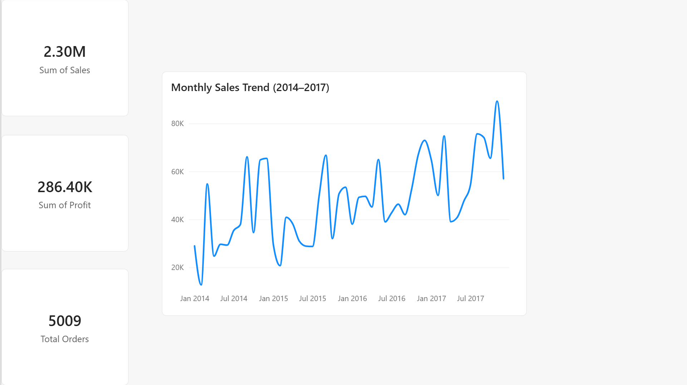
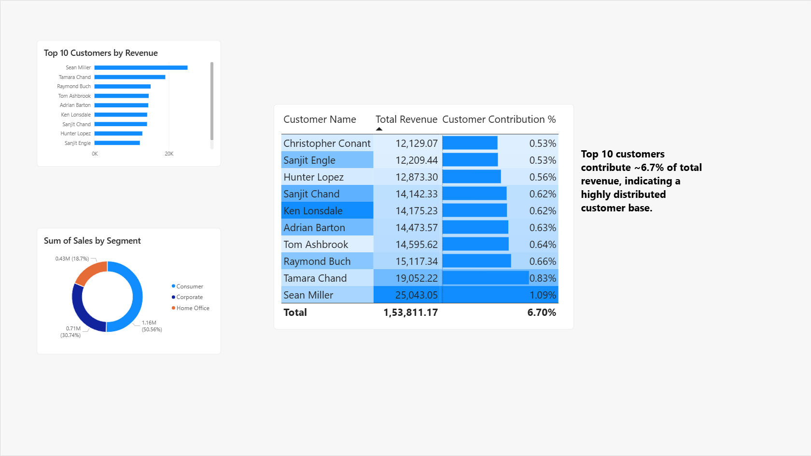
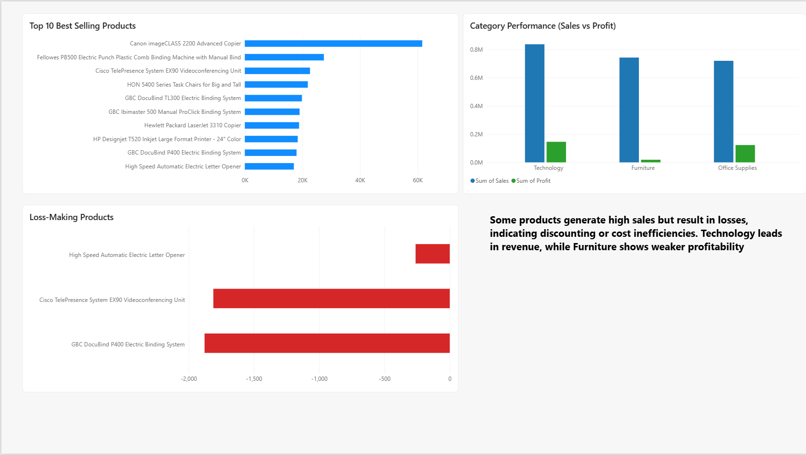

# 📊 Retail Sales Dashboard (Power BI)

## 🔍 Overview
This project is an end-to-end Power BI dashboard built using the Superstore dataset to analyze sales performance, customer behavior, and product profitability.

---

## 📊 Dashboard Preview

### Overview

### Customer Insights

### Product Insights

---

## 📌 Dashboard Pages

### 1️⃣ Overview
- Total Revenue, Profit, Orders
- Monthly sales trend
- High-level business performance

### 2️⃣ Customer Insights
- Top 10 customers by revenue
- Customer contribution to total revenue
- Revenue distribution by segment

### 3️⃣ Product Insights
- Best-selling products
- Loss-making products
- Category performance (Sales vs Profit)

---

## 💡 Key Insights
- Revenue is highly distributed across customers, with top 10 contributing only ~6.7%
- Some high-selling products generate losses, indicating pricing or discount issues
- Technology leads in revenue, while Furniture shows lower profitability

---

## 🛠 Tools Used
- Power BI
- DAX (Data Analysis Expressions)
- Data Visualization

---

## 📁 Files Included
- `.pbix` Power BI file
- Dataset (CSV)
- Dashboard screenshots

---

## 🚀 Author
Vinay N
